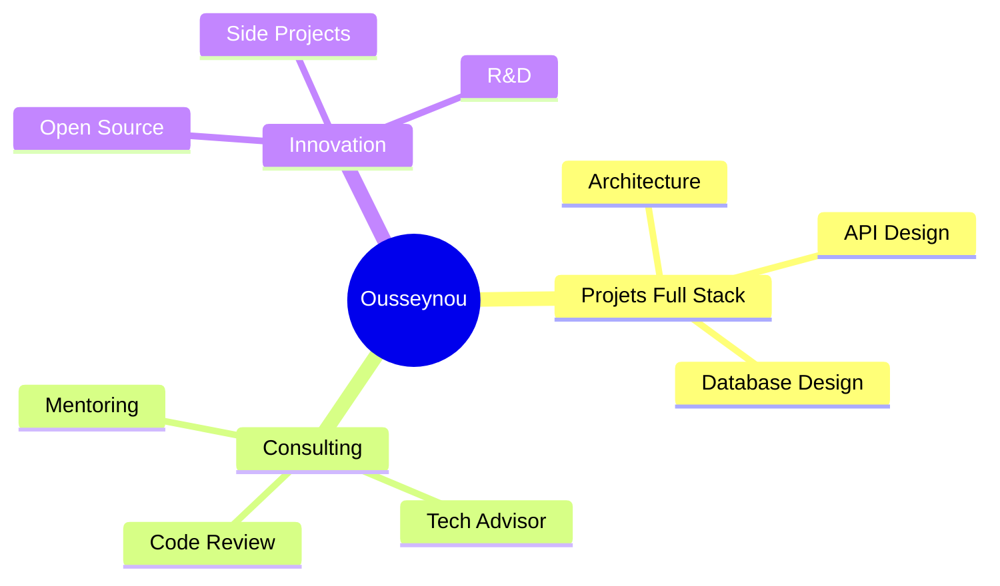

# 👨🏾‍💻 Ousseynou Ndiaye

<div align="center">

  


🚀 À propos de moi
Développeur Full Stack passionné par l'innovation technologique, je crée des solutions logicielles performantes et scalables. Expert en backend avec Spring Boot et Symfony, frontend avec React, et mobile avec Flutter, je transforme des idées complexes en applications intuitives et robustes. Toujours en quête de défis, je m'appuie sur une veille constante pour délivrer des résultats de qualité.
</div>

📍 Dakar, Sénégal

📧 Email : nousseynou20@gmail.com

🔗 LinkedIn : [Ousseynou Ndiaye](https://www.linkedin.com/in/ousseynou-ndiaye-0aa429340/)


---

## 🎯 Ce que je fais

<table>
<tr>
<td width="50%">

### 🏗️ Architecture & Backend
```java
// J'adore concevoir des systèmes robustes
@SpringBootApplication
public class Innovation {
    - Architecture monolithe distribué
    - API RESTful performantes
    - Sécurité & scalabilité
    - Patterns de conception
}
```

</td>
<td width="50%">

### 🎨 Frontend & Mobile
```javascript
// Des interfaces qui font la différence
const MagicUI = () => {
    - Applications React modernes
    - Design system avec Tailwind
    - Apps Flutter cross-platform
    - UX/UI épurée
}
```

</td>
</tr>
</table>

---

## 🛠️ Stack Technologique

<div align="center">

### Backend Universe


### Frontend & Mobile Galaxy


### Data & DevOps Constellation


</div>

---

## 🚀 Projets en Lumière

<div align="center">

<table>
<tr>
<td width="50%" valign="top">

### 📚 Ges-Absences
**Plateforme de gestion académique moderne**

🎯 Architecture microservices complète  
⚡ API REST haute performance  
🎨 Interface React responsive  
🔐 Sécurité & authentification JWT

**Tech:** Spring Boot • React • PostgreSQL

[](https://github.com/Ouzeon007/Ges-Absences-Back-Groupe9)
[](https://github.com/Ouzeon007/Ges-Absences-Font-Groupe9)

</td>
<td width="50%" valign="top">

### 💡 Vos Projets Innovants
**En construction...**

Vous développez des solutions qui changent les choses ? Épinglez vos meilleurs repos ici !

**Astuce:** Utilisez les **Pinned Repositories** sur votre profil GitHub

[](https://github.com/Ouzeon007?tab=repositories)

</td>
</tr>
</table>

</div>

---

## 📊 GitHub Analytics

<div align="center">


</div>

---

## 🤝 Let's Connect & Collaborate

<div align="center">

### 💬 Ouvert aux opportunités



### 🌐 Retrouvez-moi sur

[](https://linkedin.com/in/votre-profil)
[](https://twitter.com/votre-handle)
[](https://votre-portfolio.com)
[](https://dev.to/votre-profil)

<br/>


---


**"Code with passion, build with purpose"** 💜

</div>
